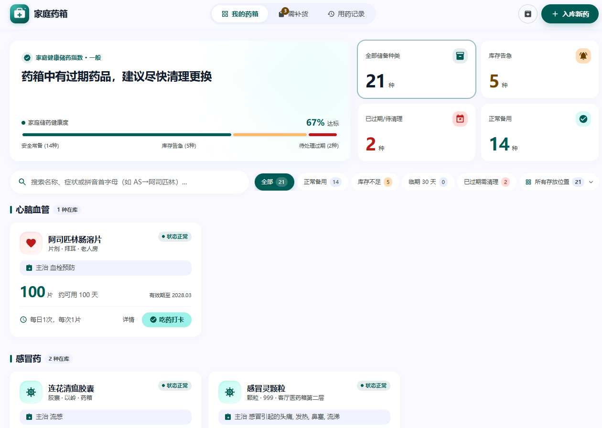
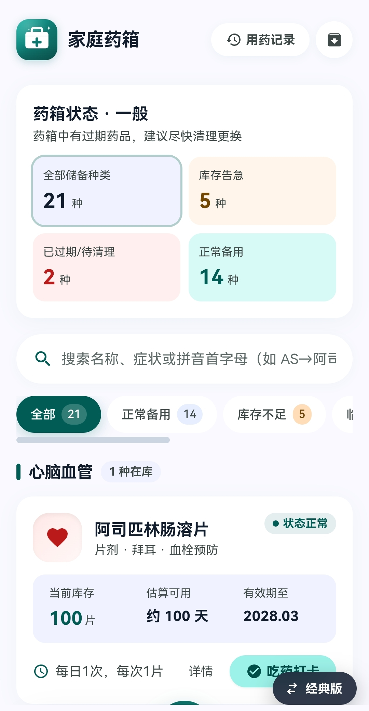
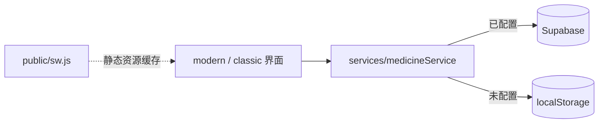

# 家庭药箱

[](https://github.com/ChenChen913/medicine-box/actions/workflows/ci.yml)
[](LICENSE)

记录家庭药品库存与效期，过期或用尽自动进入补货清单的本地优先 Web 应用

**在线演示：** https://chenchen913.github.io/medicine-box/



## 目录

- [为什么做这个项目](#为什么做这个项目)
- [快速开始](#快速开始)
- [用法](#用法)
- [配置](#配置)
- [项目结构](#项目结构)
- [开发](#开发)
- [常见问题](#常见问题)
- [已知限制](#已知限制)
- [如何贡献](#如何贡献)
- [许可证](#许可证)

## 为什么做这个项目

> 家里有很多各种品类的药，时间长了，每个药都得看一下是否过期，每种药都要看的话就很麻烦。如果我把它做成一个线上的系统，就会很方便

**设计取舍**：项目刻意不做账号体系——数据默认只存在你自己的浏览器里，不注册、不上传；补货清单不靠手动维护，完全由「过期 / 用尽」两条规则自动产生；界面同时保留 Material 3 新版与经典版两套实现，用同一套服务层支撑两种交互。这些取舍的代价写在[已知限制](#已知限制)里。

## 快速开始

前置要求：Node.js >= 18.18.0（仓库 `.nvmrc` 为 20）与 npm。

```sh
git clone https://github.com/ChenChen913/medicine-box.git
cd medicine-box
npm install
npm run dev
```

打开 http://localhost:5173 即可使用。首次打开是空药箱，入库第一种药就能看到完整界面。

## 用法



**入库**：点「入库新药」，填名称、数量、有效期。同名同品牌再次入库会合并到同一条记录。

**打卡服药**：点卡片上的按钮或详情里的「打卡服药」，库存按「每次用量」扣减，同时写入用药记录（含品牌快照）。

**补货清单**：药品过期或用尽时自动进入清单，不需要手动添加。买到后点「已买入登记」，登记数量与新效期即完成核销。

**用药记录**：时间线 + 近 30 天统计，可随备份一起导出。

**备份与恢复**：导出 JSON 备份，支持「合并」与「覆盖」两种导入方式；导入会校验版本与日期合法性。

**两套界面**：默认新版（Material 3），用 `?ui=classic` 可切到经典版；切换会记住偏好。

## 配置

应用不需要配置就能运行。默认把数据存在浏览器 localStorage；接 Supabase 可换成云端存储。

| 环境变量 | 必填 | 默认值 | 说明 |
|---------|------|--------|------|
| `VITE_SUPABASE_URL` | 否 | 无 | Supabase 项目地址。不设置时走 localStorage |
| `VITE_SUPABASE_ANON_KEY` | 否 | 无 | Supabase 前端公开密钥；安全边界由数据库 RLS 策略保证 |

本地开发时复制 `.env.example` 为 `.env.local` 并填入上面两项。两个变量都为「公开可见」（会打进前端产物），不要放 `service_role` 密钥。

线上部署走 GitHub 仓库 Secrets 的同名变量，由 `.github/workflows/deploy.yml` 在构建时注入。

## 项目结构

```text
modern/            新版 UI（Material 3）：组件、弹层无障碍钩子、状态与配色工具
ui/classic/        经典版 UI（?ui=classic 切换）
services/          服务层：数据读写、业务规则、localStorage 与 Supabase 双后端降级
scripts/           测试与工具：服务层测试、UI 逻辑测试、浏览器 E2E、变异检查
supabase/          建表脚本 schema.sql（含 RLS 策略）
public/            PWA 资源：图标、manifest、Service Worker sw.js
docs/              验收标准与判定记录、代码审查、经验沉淀
backup/            演示数据快照
```

数据流：界面只调用 `services/` 暴露的方法；服务层读取时先判断是否配置了 Supabase，没有则走 localStorage，两条路径共用同一套业务规则。



## 开发

```sh
npm run typecheck   # tsc --noEmit
npm test            # 服务层 171 条 + UI 逻辑 91 条
npm run lint        # eslint
npm run build       # tsc && vite build
npm run test:e2e    # 浏览器端 80 条（Puppeteer 驱动本机 Chrome）
npm run test:all    # 类型检查 + 单元 + lint + 浏览器 E2E
```

数字都由命令产生，可自行复现：`npm test` 输出 `TOTAL=171 PASS=171 FAIL=0` 与 `TOTAL=91 PASS=91 FAIL=0`；`npm run test:e2e` 输出 `E2E TOTAL=80 PASS=80 FAIL=0`。

浏览器端覆盖：渲染与响应式（320 / 360 / 390 / 768 / 1440）、核心链路、对抗输入（投毒备份、XSS、存储配额写失败）、
无障碍与键盘（焦点管理、Tab 锁定、24×24 目标尺寸、axe 扫描 10 个界面状态）、PWA 离线、历史缺陷回归墙。

另有一个手动运行的变异检查：`node scripts/mutation-check.mjs` 会把 5 条历史缺陷的防线逐个改坏，要求用例集必须失败（当前 5/5 被抓）。

CI（`.github/workflows/ci.yml`）在每次推送 `main` 时依次执行：类型检查 → 单元测试 → ESLint → 构建 → 浏览器 E2E。

## 常见问题

**Q：数据存在哪里？**
A：默认存在当前浏览器的 localStorage（键名 `smart-medicine-box:db:v1`），不会上传到任何服务器。

**Q：换手机或换电脑怎么办？**
A：用「数据备份与恢复」导出 JSON，在新设备导入；或配置 Supabase 走云端同步。

**Q：为什么不做后端？**
A：家庭药箱是单人或家庭场景，本地优先能免去登录和部署成本；需要多设备时再启用 Supabase 分支即可，业务代码不用改。

**Q：怎么切回经典版界面？**
A：网址后加 `?ui=classic`。

**Q：点开详情偶尔要等一下？**
A：详情抽屉与备份弹窗按需加载，空闲时会预取；弱网下首次点开会短暂显示「加载中」。

## 已知限制

- 默认单机存储：换设备不同步，清除浏览器数据会丢失（可用备份导入恢复）
- 云端同步代码已就绪，但尚未配置 Supabase 账号，线上跑的是 localStorage 分支
- 多标签页同时修改是 last-writer-wins，后写覆盖先写
- 不做用药提醒推送与闹钟
- 仅作记录用途，不构成任何医疗建议
- 首屏存在内容位移（Lighthouse 桌面预设实测 CLS 0.9）：应用挂载后才异步读取数据，先渲染空壳再填充；修法是让本地存储分支在首帧前同步取数

## 如何贡献

仓库暂无 `CONTRIBUTING.md`。发现问题或想提改进，直接开 [Issue](https://github.com/ChenChen913/medicine-box/issues) 或提 PR 即可。

## 许可证

[MIT](LICENSE) © 2026 ChenChen913
